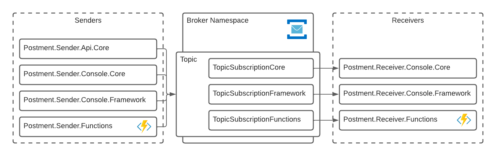
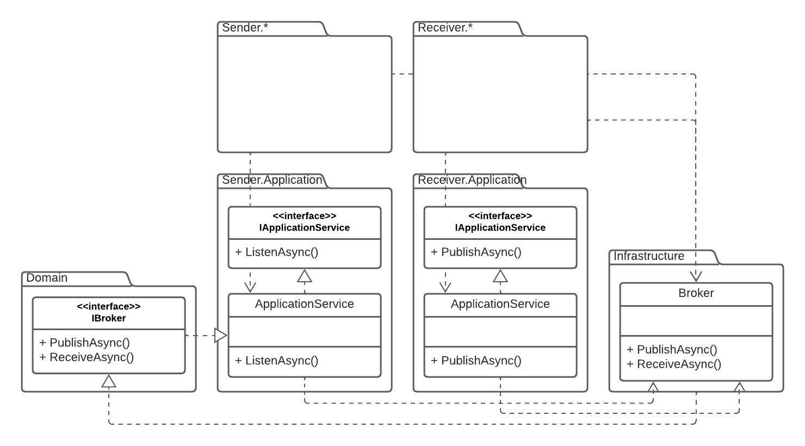

# Postmen

A bunch of examples on how to publish and consume messages via Azure Service Bus broker.

## Implementation



Postmen has two groups of applications<br />
One called **Senders**, can post messages into a Topic in Azure Service Bus. All these applications post messages to the same Topic called by default **postcreated**.
Other called **Receivers**, can receive posted messages throught a Topic Subscription. Each kind of application is connected to tis own subscription like:

- `Postmen.Receiver.Console.Core` listens **postcreatedsubscriptioncore**;
- `Postmen.Receiver.Console.Framework` listens **postcreatedsubscriptionframework**;
- `Postmen.Receiver.Functions` listens **postcreatedsubscriptionfunctions**;



## Local Configuration

### Cloud infrastructure

To setup broker infrastructure:

```sh
# '~' is used to represent the project`s root folder
cd ~/src/environment
az login
terraform init
terraform apply
# to get broker connection string
terraform output BrokerConnectionString
```

### For .Net Framework Apps

.Net Framework apps uses environment variables to manage connection strings<br />
Before run .Net Framework apps, it's necessary to configure local Environment Variables:

```ps1
# <BrokerConnectionString> got from terraform execution
[System.Environment]::SetEnvironmentVariable('ConnectionStrings:ServiceBus','<BrokerConnectionString>')
```

### For .Net Core Apps

.Net Core apps uses user secrets to manage connection strings.<br />
Before run .Net Core apps, it's necessary to configure user secrets.
To do so, inside the .Net Core project folder:

```sh
# <BrokerConnectionString> got from terraform execution
dotnet user-secrets init
dotnet user-secrets set "ConnectionStrings:ServiceBus" "<BrokerConnectionString>"
```

### For Azure Functions Apps

Before run Azure Functions Apps, it's necessary to create a local configuration file - named `local.settings.json` - inside the Azure Functions App project folder:

```json
// File local.settings.json
// <BrokerConnectionString> got from terraform execution
{
  //...
  "Values": {
    //...
    "ServiceBusConnectionString": "<BrokerConnectionString>"
  }
}
```

## Running

Notice that you probably wanna run at least one instance of _senders_ and one of _receivers_. All _senders_ and _receivers_ are connected to the same single broker.

### Running .Net Framework Apps

Just open the project in Visual Studio and start the application.

### Running .Net Core Apps

.Net Core apps have configuration to set the `DOTNET_ENVIRONMENT` to _Development_ so the `user-secrets` mechanism can work correctly (check `Properties/launchSettings.json`).<br />
To run .Net Core apps you can open the application in Visual Studio or Visual Studio Code and hit run or, inside the project folder:

```sh
dotnet run
```

### Running Azure Functions Apps

To run multiple instances of Azure Functions Apps locally, these projects where configure to use non default debug ports. Keep in mind that debuging _Sender_ function will allocate `7072` and _Receiver_, `7073`.<br />
To run Azure Functions Apps you can open the application in Visual Studio or Visual Studio Code and hit run or, insisde the project folder:

```sh
func start
```

## Dependencies

- [Terraform 1.0](https://www.terraform.io/downloads.html)
- [Free Azure Account](https://azure.microsoft.com/free/) _(services used in this examples aren`t free)_
- [Azure CLI 2.28](https://docs.microsoft.com/en-us/cli/azure/install-azure-cli)

Used to create these examples but completly optional:

- [Visual Studio Code](https://code.visualstudio.com/)

### For .Net Framework Apps

- [Visual Studio 2019](https://visualstudio.microsoft.com/pt-br/downloads/)
- [.Net Framework SDK 4.8](https://dotnet.microsoft.com/en-us/download/dotnet-framework)

### For .Net Core Apps

- [.Net Core SDK 3.1](https://dotnet.microsoft.com/en-us/download/dotnet)

### For Azure Functions Apps

- [Azure Functions Core Tools 3.0](https://docs.microsoft.com/en-us/azure/azure-functions/functions-run-local#install-the-azure-functions-core-tools)
